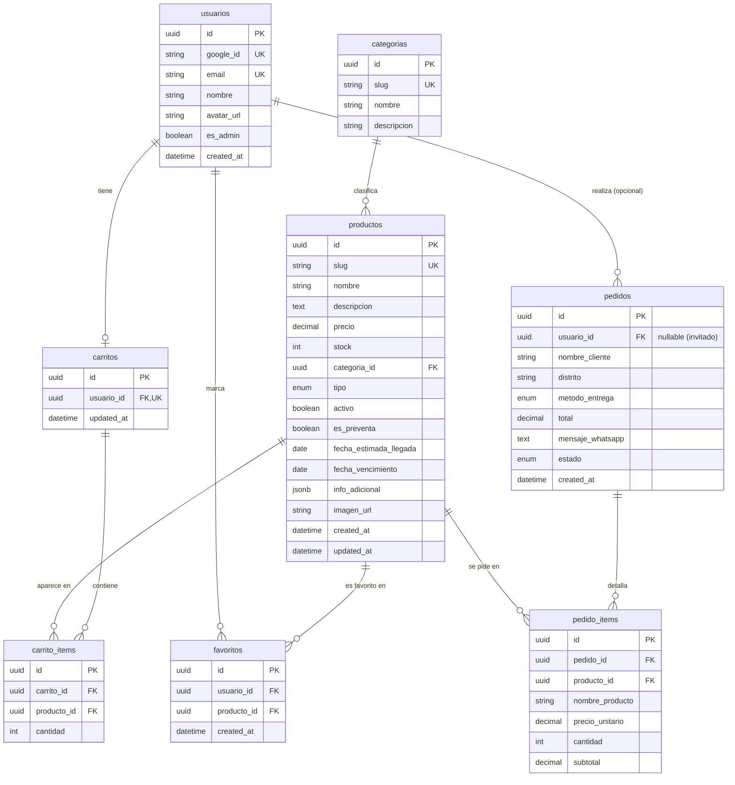

# 02 — Modelo de datos (DER)

Modelo relacional físico para **PostgreSQL** (gestionado con Prisma). Soporta catálogo,
carrito guardado por usuario, favoritos, sesión Google opcional y registro de pedidos.

## 1. Entidades

| Entidad | Descripción |
|---------|-------------|
| `usuarios` | Usuario autenticado con Google (opcional). Guarda carrito/favoritos. |
| `categorias` | Categorías del catálogo (Skincare, Snacks & Foods, Peluches, Accesorios, Colecciones, Drops). |
| `productos` | Producto del catálogo. Estado derivado de `stock` + banderas (RB19). |
| `favoritos` | Relación usuario–producto (única por par → RB08). |
| `carritos` | Carrito guardado de un usuario (1:1). |
| `carrito_items` | Ítems del carrito guardado (único por producto → sin duplicados). |
| `pedidos` | Intento de pedido enviado por WhatsApp (RB22). Cliente puede ser invitado. |
| `pedido_items` | Ítems del pedido con **snapshot** de nombre y precio al momento del pedido. |

## 2. Diagrama entidad-relación (Mermaid)



## 3. Reglas de integridad relevantes

- `productos.precio` ≥ 0 y `productos.stock` ≥ 0.
- `favoritos (usuario_id, producto_id)` **UNIQUE** → refuerza RB08 a nivel de BD.
- `carrito_items (carrito_id, producto_id)` **UNIQUE** → un producto no se duplica en el carrito.
- `carritos.usuario_id` **UNIQUE** → un carrito guardado por usuario.
- `carrito_items.cantidad` ≥ 1 (RB07) y ≤ `productos.stock` al validar (RB01).
- **Borrado lógico**: desactivar un producto pone `activo = false`; no se elimina físicamente
  si tiene historial en `pedido_items` (RB10).
- `pedido_items` guarda `nombre_producto` y `precio_unitario` como **snapshot** para que el
  historial no cambie aunque el producto se edite luego.
- `usuarios.es_admin` se sincroniza desde la allowlist `ADMIN_EMAILS` (ADR-05).

## 4. Enumeraciones

- `tipo` (producto): `skincare | snack | peluche | accesorio | coleccion | drop | general`
- `metodo_entrega` (pedido): `recojo | delivery`
- `estado` (pedido): `pendiente | coordinado | entregado | cancelado`

## 5. Esquema Prisma (borrador)

```prisma
// backend/src/prisma/schema.prisma
generator client { provider = "prisma-client-js" }
datasource db { provider = "postgresql"; url = env("DATABASE_URL") }

enum TipoProducto { skincare snack peluche accesorio coleccion drop general }
enum MetodoEntrega { recojo delivery }
enum EstadoPedido { pendiente coordinado entregado cancelado }

model Usuario {
  id        String     @id @default(uuid())
  googleId  String     @unique @map("google_id")
  email     String     @unique
  nombre    String
  avatarUrl String?    @map("avatar_url")
  esAdmin   Boolean    @default(false) @map("es_admin")
  createdAt DateTime   @default(now()) @map("created_at")
  carrito   Carrito?
  favoritos Favorito[]
  pedidos   Pedido[]
  @@map("usuarios")
}

model Categoria {
  id          String     @id @default(uuid())
  slug        String     @unique
  nombre      String
  descripcion String?
  productos   Producto[]
  @@map("categorias")
}

model Producto {
  id                    String        @id @default(uuid())
  slug                  String        @unique
  nombre                String
  descripcion           String
  precio                Decimal       @db.Decimal(10, 2)
  stock                 Int           @default(0)
  categoriaId           String        @map("categoria_id")
  categoria             Categoria     @relation(fields: [categoriaId], references: [id])
  tipo                  TipoProducto  @default(general)
  activo                Boolean       @default(true)
  esPreventa            Boolean       @default(false) @map("es_preventa")
  fechaEstimadaLlegada  DateTime?     @map("fecha_estimada_llegada") @db.Date
  fechaVencimiento      DateTime?     @map("fecha_vencimiento") @db.Date
  infoAdicional         Json?         @map("info_adicional") // tipo_piel, modo_uso, advertencia, alergenos
  imagenUrl             String?       @map("imagen_url")
  createdAt             DateTime      @default(now()) @map("created_at")
  updatedAt             DateTime      @updatedAt @map("updated_at")
  favoritos             Favorito[]
  carritoItems          CarritoItem[]
  pedidoItems           PedidoItem[]
  @@map("productos")
}

model Favorito {
  id         String   @id @default(uuid())
  usuarioId  String   @map("usuario_id")
  productoId String   @map("producto_id")
  usuario    Usuario  @relation(fields: [usuarioId], references: [id])
  producto   Producto @relation(fields: [productoId], references: [id])
  createdAt  DateTime @default(now()) @map("created_at")
  @@unique([usuarioId, productoId])
  @@map("favoritos")
}

model Carrito {
  id        String        @id @default(uuid())
  usuarioId String        @unique @map("usuario_id")
  usuario   Usuario       @relation(fields: [usuarioId], references: [id])
  items     CarritoItem[]
  updatedAt DateTime      @updatedAt @map("updated_at")
  @@map("carritos")
}

model CarritoItem {
  id         String   @id @default(uuid())
  carritoId  String   @map("carrito_id")
  productoId String   @map("producto_id")
  cantidad   Int
  carrito    Carrito  @relation(fields: [carritoId], references: [id], onDelete: Cascade)
  producto   Producto @relation(fields: [productoId], references: [id])
  @@unique([carritoId, productoId])
  @@map("carrito_items")
}

model Pedido {
  id              String        @id @default(uuid())
  usuarioId       String?       @map("usuario_id")
  usuario         Usuario?      @relation(fields: [usuarioId], references: [id])
  nombreCliente   String        @map("nombre_cliente")
  distrito        String
  metodoEntrega   MetodoEntrega @map("metodo_entrega")
  total           Decimal       @db.Decimal(10, 2)
  mensajeWhatsapp String        @map("mensaje_whatsapp")
  estado          EstadoPedido  @default(pendiente)
  createdAt       DateTime      @default(now()) @map("created_at")
  items           PedidoItem[]
  @@map("pedidos")
}

model PedidoItem {
  id             String   @id @default(uuid())
  pedidoId       String   @map("pedido_id")
  productoId     String   @map("producto_id")
  nombreProducto String   @map("nombre_producto")
  precioUnitario Decimal  @map("precio_unitario") @db.Decimal(10, 2)
  cantidad       Int
  subtotal       Decimal  @db.Decimal(10, 2)
  pedido         Pedido   @relation(fields: [pedidoId], references: [id], onDelete: Cascade)
  producto       Producto @relation(fields: [productoId], references: [id])
  @@map("pedido_items")
}
```

---
_Control de cambios: v1.0 (2026-07-07) — versión inicial._
